# Доработка ERP-системы для компании "Комтелеком-Т"

**Заказчик:** Телекоммуникационная компания АО "Комтелеком-Т" 
**Проект:** Крупная ERP-система с функционалом управления: складом / заказами / SIM-картами / трафиком / тарифными планами / тикетами / отчетами и документами / аккаунтами пользователей / ролями и правами доступа 
**Роль:** Frontend разработчик 
**Стек:** Vue 2 | Options API | JS | Vuex | AntDesign | Axios

**Задачи:** 
Разработка пользовательского интерфейса для функционала: 
1 - Управление возвратами оборудования 
2 - Управление покупками оборудования 
3 - Управление обслуживанием оборудования

## Screenshots
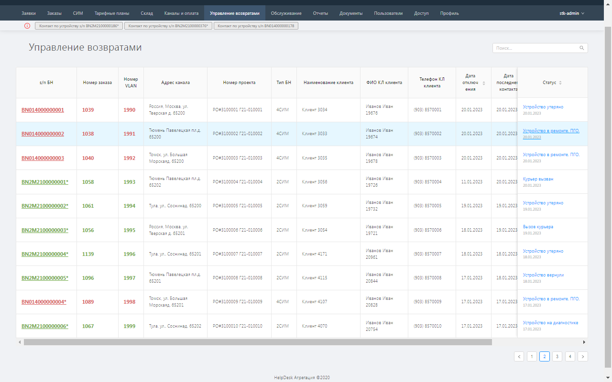
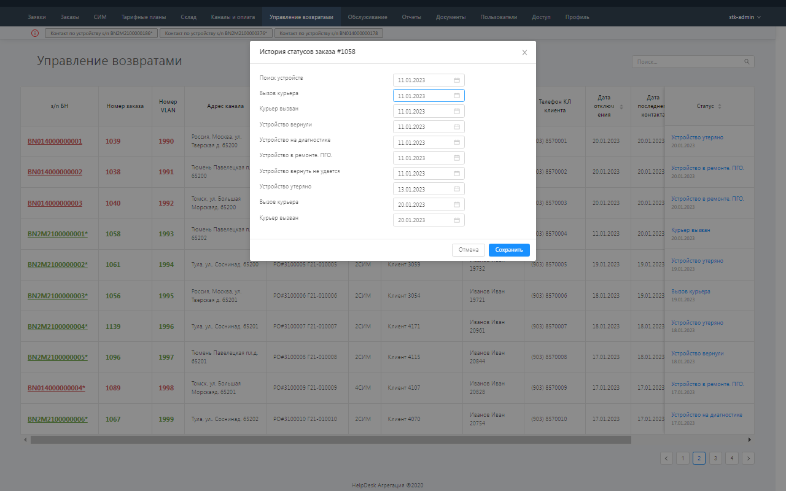
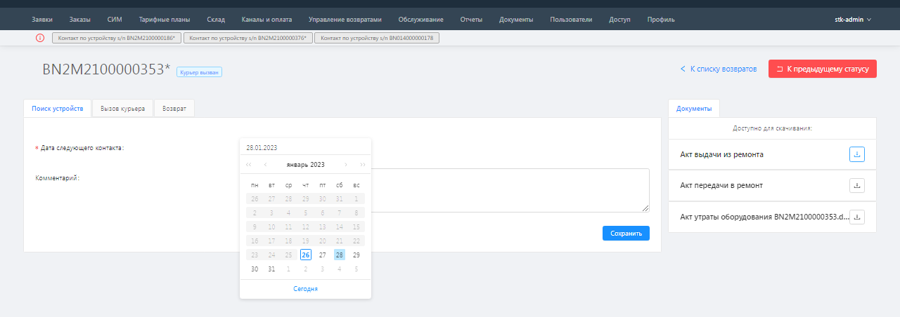
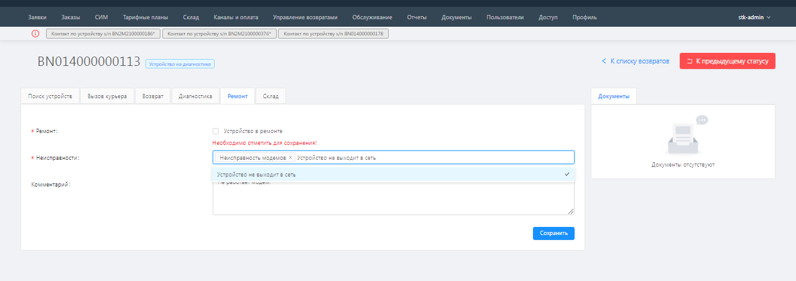
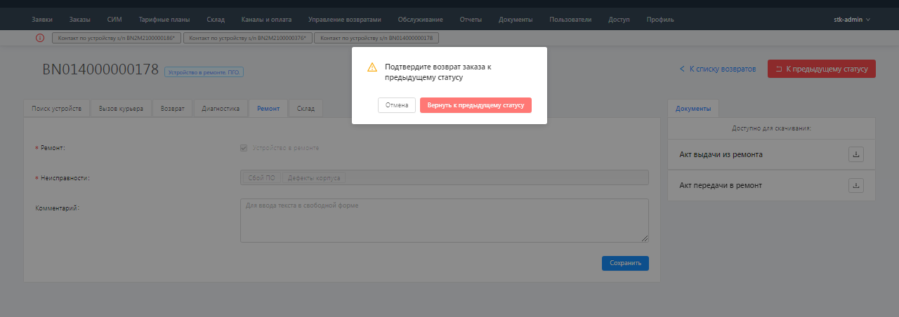
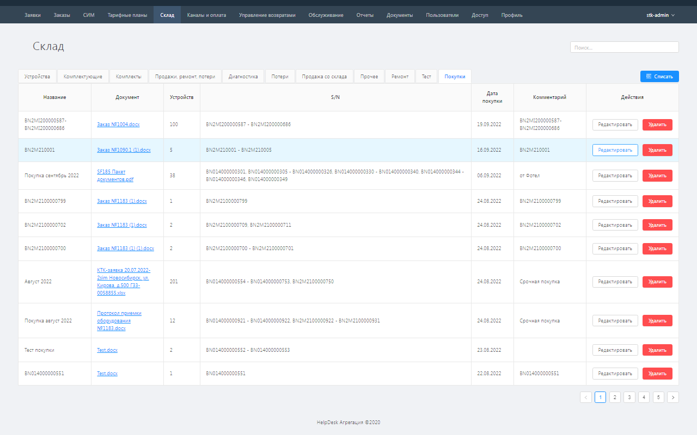
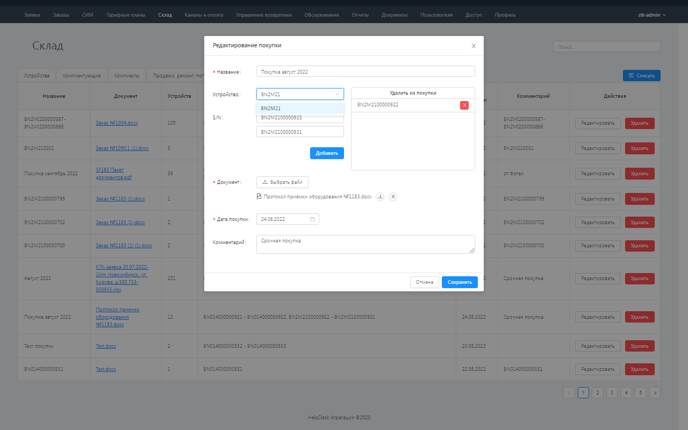
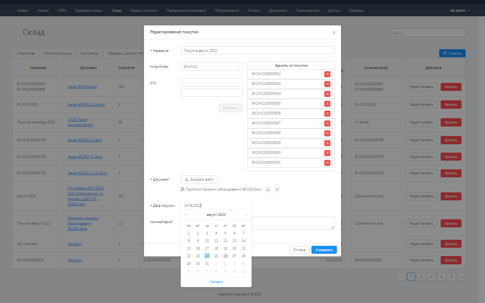
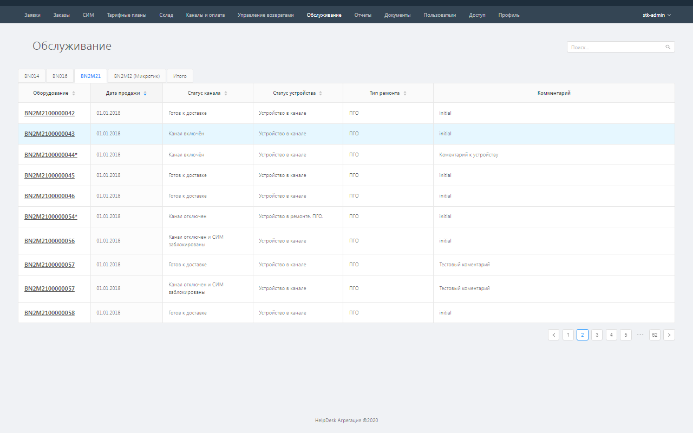
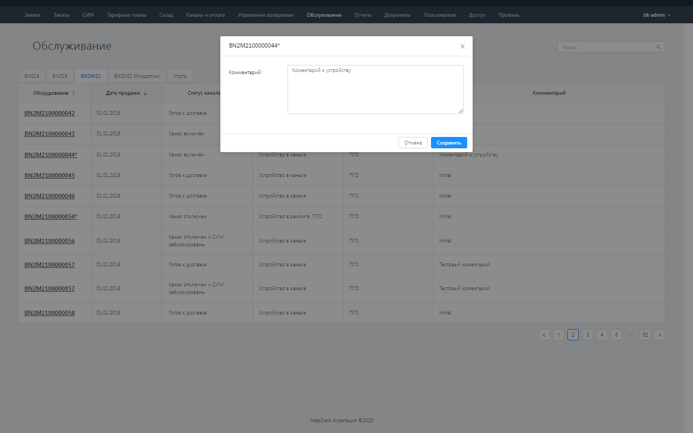
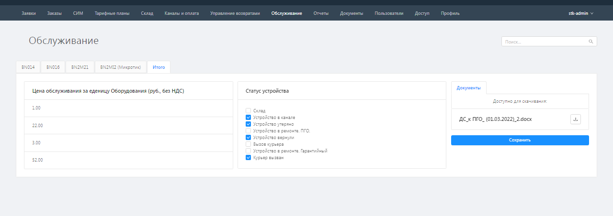
